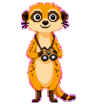
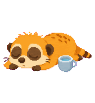

# claude-pet — 狐獴桌宠

四只狐獴（Scout / Knox / Bubbles / Pip）实时盯着你的 Claude Code 会话，把 hook 事件画成桌面动画。

## 角色

四只狐獴各自分担一块认知关注点，互不替代。下图是各自 idle 状态的真身像素动画。

<table>
  <tr>
    <td align="center" width="25%"><br><b>Scout</b><br>🔭</td>
    <td align="center" width="25%"><br><b>Knox</b><br>🔔</td>
    <td align="center" width="25%"><br><b>Bubbles</b><br>💧</td>
    <td align="center" width="25%"><br><b>Pip</b><br>🎉</td>
  </tr>
  <tr>
    <td><b>哨兵</b>·戴望远镜的会话状态监视者。所有 Claude Code 事件都让它做反应，自身 sprite 1:1 镜像当前会话状态（idle / thinking / running / waiting / completed / stale / failed）。双击它可以集合其他三只回到身边。</td>
    <td><b>盘查守门员</b>·红头巾 + 金铃铛 + 木牌。`Notification` hook 或 PreToolUse 后 1.5s 没等到 PostToolUse（推断终端在等权限确认）时举牌提醒，10s 后升级为跳跃催促，点一下盖章通过。</td>
    <td><b>健康小睡魔</b>·平时趴着睡觉，每 45 分钟提醒一次喝水/起身/护眼，被点也会主动来一次。</td>
    <td><b>庆祝派</b>·`Stop` / `SubagentStop` 触发撒花跳舞，每次随机播 1–3 轮彩纸，连发不限速。AFK 后入睡也有专属"settle → breathe" 两段循环。</td>
  </tr>
</table>

## 安装

两种方式任选。装好之后还得跑一次 hook 注入（B 方式自带），才能让 Claude Code 把事件推到 pet。

### A. 从 GitHub Release 下载 .app（仅 macOS）

1. 打开 [Releases](https://github.com/summer95950905-hue/claude-pet/releases)，按机型挑文件下载：
   - Apple Silicon (M1/M2/M3/M4)：`claude-pet-<version>-arm64.dmg`
   - Intel Mac：`claude-pet-<version>.dmg`
   - 不想用 dmg 的话 `*-mac.zip` 也是同一个 .app。
2. 打开 .dmg，把 **claude-pet.app** 拖进 `/Applications`。
3. 首次启动：在 Finder 里**右键 → 打开 → 确认打开**（应用未签名，需手动绕过 Gatekeeper，只需一次）。
4. 注入 Claude Code hooks：当前版本还没把这一步做进托盘菜单，需要单独跑一下：
   ```bash
   curl -fsSL https://raw.githubusercontent.com/summer95950905-hue/claude-pet/main/hooks/install-hooks.js | node
   ```
   或者下载 `hooks/install-hooks.js` 后 `node install-hooks.js` 执行。脚本会自动备份 `~/.claude/settings.json` 到 `~/.claude/settings.json.deskpet-backup`。

### B. 从源码运行（开发 / 自己改）

需要本机有 Node 18+。

```bash
git clone git@github.com:summer95950905-hue/claude-pet.git
cd claude-pet
npm install
npm run install-hooks   # 注入 hooks 到 ~/.claude/settings.json（自动备份）
npm start               # 启动桌宠
```

启动后右下角出现 4 只狐獴。托盘图标可以 Show/Hide、切尺寸、退出。

## 卸载 hooks

```bash
# 源码方式
npm run uninstall-hooks

# 或仅有 install-hooks.js 时
node hooks/install-hooks.js --uninstall
```

会还原回 `~/.claude/settings.json` 中 claude-pet 注入前的状态。原始备份在 `~/.claude/settings.json.deskpet-backup`。

## 架构

```
Claude Code session
    └── hooks (Notification / Stop / PreToolUse / ...)
          └── curl POST → http://127.0.0.1:8765/event  (X-Hook: <event>)
                └── Electron main → IPC → renderer
                      └── state machine → 4 meerkats
```

- `main.js` — Electron 主进程，透明置顶窗口 + HTTP 接收器 + 菜单栏图标
- `preload.js` — IPC 桥
- `renderer/` — 4 只狐獴 + 状态机 + 动画
- `hooks/install-hooks.js` — settings.json 注入 / 卸载

## 已知限制

- 点 Knox 目前只在桌宠端弹气泡，还没接 macOS 终端窗口聚焦（AppleScript 待补）
- 几个阈值是写死的常量（`staleAfterMs` 60s / `waterIntervalMs` 45min / `celebrateCooldownMs` 30s / `AFK_THRESHOLD_MS` 2min），没有 settings 面板
- 只追一个 Claude Code 会话；多窗口 / 多会话区分尚未做
- 高风险命令识别没做，所有 `Notification` 一律走同一条提醒路径
- macOS .app 未签名公证，首次启动需 Finder 右键 → 打开（一次性）
- 仅 macOS 构建；Windows / Linux 暂未打包

## 调试

- 看 hook 是否落到 server：`curl -X POST -H 'X-Hook: Stop' http://127.0.0.1:8765/event`（可换 `Notification` / `PreToolUse` / `SessionEnd` 等测各状态）
- 看 hooks 是否装上：`grep deskpet-hook ~/.claude/settings.json`
- 看 Electron 主进程日志：`npm start` 终端会打印每条 hook 事件的时间戳与类型
- 强制集合：双击 Scout（其他三只会以恒定速度滑回 Scout 右侧）

## 下一步开发计划

目前 deskpet 的角色形象与行为逻辑是固定的——下一阶段计划将整套创作工作流封装为一个可复用的 **Claude Code Skill**，让任何人都能用自然语言描述自己想要的宠物形象与性格，由 AI 完成从角色设定、精灵图生成到动画接入的全流程，最终输出一只属于自己的专属桌宠。

**目标能力：**

- 描述角色 → AI 自动生成像素风精灵图及完整 spritesheet
- 自定义每个状态的触发条件与动画行为（如把 Knox 换成你喜欢的任意角色）
- 一键替换现有角色，无需修改任何代码
- Skill 对外开放，社区成员可自由创作、分享皮肤包
